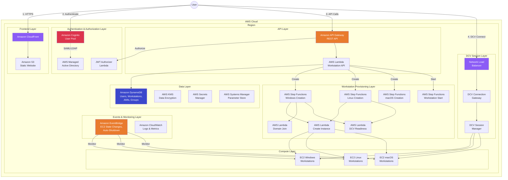
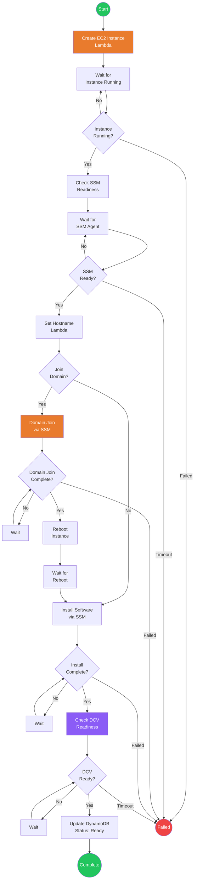
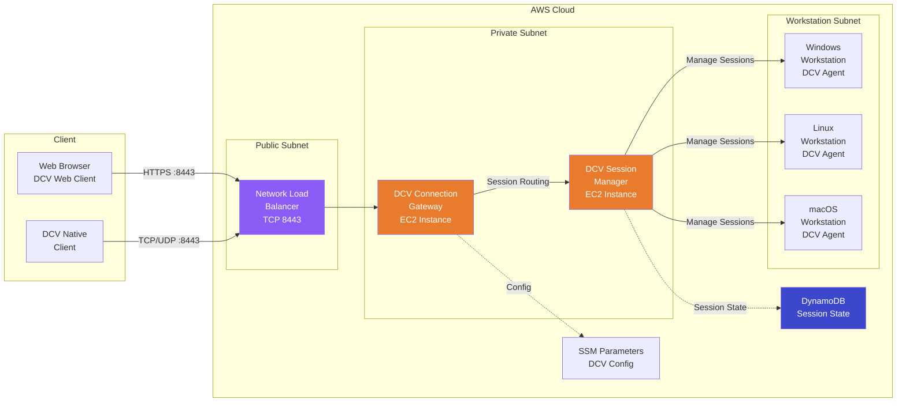
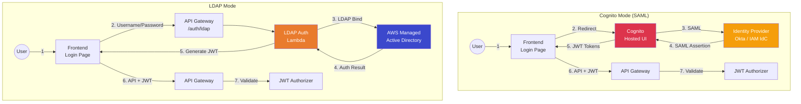
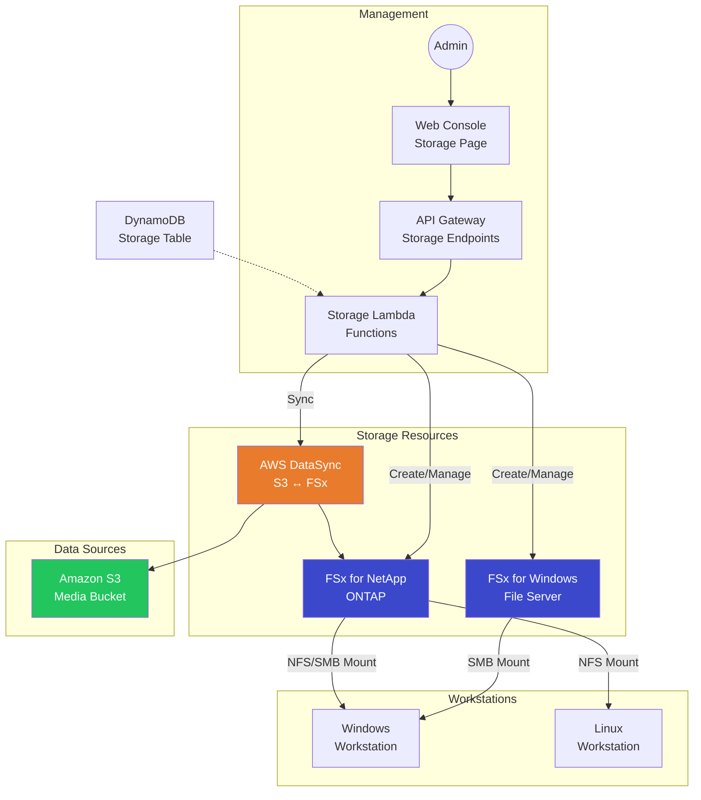
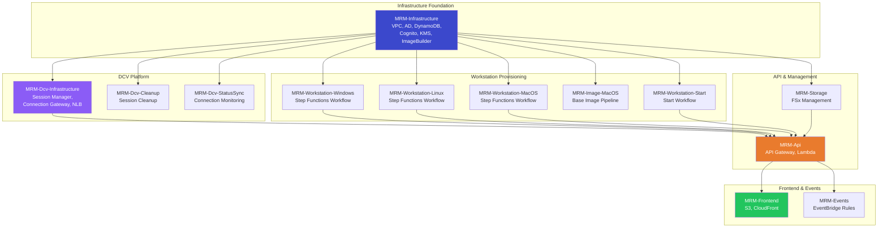

# AWS Media Resource Manager — Architecture Diagrams

## High-Level Application Architecture

This diagram shows the high-level API, authentication, workstation management, and frontend architecture of Media Resource Manager.

### Architecture Notes

1. **Users** access the web console through **Amazon CloudFront**, which serves the React application from **Amazon S3**.
2. **Amazon Cognito** handles user authentication with support for SAML federation (Okta, IAM Identity Center) or LDAP via **AWS Managed Active Directory**.
3. **API Gateway** routes authenticated requests through a **JWT Authorizer Lambda** to the **Workstation API Lambda**, which manages all CRUD operations against **DynamoDB**.
4. Workstation creation is orchestrated by **AWS Step Functions** workflows (separate for Windows, Linux, and macOS), which invoke Lambda functions for instance creation, domain joining, and DCV readiness checks.
5. Users connect to workstations via **Amazon DCV** through a **Network Load Balancer** → **DCV Connection Gateway** → **DCV Session Manager** path.
6. **Amazon EventBridge** monitors EC2 state changes, enforces auto-shutdown policies, and triggers authentication mode updates.
7. All sensitive data is encrypted with **AWS KMS** customer-managed keys. Credentials are stored in **AWS Secrets Manager**.

---

## Workstation Provisioning Workflow

This diagram shows the Step Functions workflow for creating a new workstation.

### Workflow Notes

1. **Create EC2 Instance** — Launches the instance with the selected AMI, instance type, and security group. Assigns a unique hostname from the DynamoDB counter.
2. **SSM Readiness** — Waits for the SSM agent to come online so subsequent commands can be sent.
3. **Hostname Assignment** — Sets the machine hostname using an atomic DynamoDB counter (e.g., `vdi-0001`).
4. **Domain Join** (Windows only, optional) — Joins the instance to AWS Managed Active Directory via SSM `AWS-JoinDirectoryServiceDomain`.
5. **Software Installation** — Runs SSM commands to install additional software from the image pipeline configuration.
6. **DCV Readiness** — Verifies the DCV agent is running and the session can be created.

---

## DCV Connection Architecture

This diagram shows how users connect to workstations via Amazon DCV.

### Connection Notes

1. Users connect via **web browser** (WebSocket over HTTPS) or the **DCV native client** (TCP/UDP with QUIC support for lower latency).
2. The **Network Load Balancer** terminates TLS and routes traffic to the **DCV Connection Gateway**.
3. The **Connection Gateway** authenticates the session token and routes the connection to the correct workstation via the **Session Manager**.
4. The **Session Manager** tracks active sessions, manages session lifecycle, and coordinates with DCV agents on each workstation.
5. **QUIC protocol** (UDP 8443-8444) provides lower latency for the native client. NACLs must allow UDP traffic for this to work.

---

## Authentication Flows

### Authentication Notes

- **Cognito Mode**: Users are redirected to the Cognito Hosted UI, which federates to the configured SAML provider (Okta or IAM Identity Center). After authentication, Cognito issues JWT tokens used for API authorization.
- **LDAP Mode**: Users enter credentials directly in the frontend. The LDAP Auth Lambda binds to AWS Managed Active Directory to verify credentials, then issues a JWT token.
- **Mode Switching**: Authentication mode is controlled via SSM Parameter Store. EventBridge automation updates the frontend configuration when the mode changes.

---

## Storage Architecture (FSx Integration)

### Storage Notes

1. Administrators create and manage storage resources (FSx file systems) through the web console.
2. **FSx for Windows File Server** provides SMB shares for Windows workstations, integrated with Active Directory.
3. **FSx for NetApp ONTAP** supports both NFS and SMB, works with both Windows and Linux workstations without requiring AD.
4. **AWS DataSync** synchronizes data between S3 media buckets and FSx file systems.
5. Mount scripts are automatically deployed to workstations at login via SSM, mapping network drives to the assigned storage.

---

## Stack Deployment Architecture

### Deployment Notes

- **13 specialized stacks** deployed in dependency order for modularity and independent updates.
- **MRM-Infrastructure** is the foundation — all other stacks depend on it for VPC, database, identity, and encryption resources.
- **MRM-Api** is the central hub — it depends on the DCV and workstation stacks for their Step Functions ARNs.
- Stacks can be updated independently. For example, updating the frontend doesn't require redeploying the infrastructure.

---

## AWS Services Used

| Category | Services |
|----------|----------|
| Compute | EC2 (Windows, Linux, macOS), Lambda, Step Functions |
| Networking | VPC, NLB, CloudFront, Route 53 Resolver |
| Remote Desktop | Amazon DCV (Connection Gateway, Session Manager) |
| Database | DynamoDB |
| Storage | S3, FSx for Windows, FSx for NetApp ONTAP |
| Identity | Cognito, AWS Managed Active Directory, IAM |
| Security | KMS, Secrets Manager, Security Groups, NACLs |
| Integration | API Gateway, EventBridge, SSM Parameter Store |
| Imaging | EC2 Image Builder |
| Data Transfer | AWS DataSync |
| Monitoring | CloudWatch Logs & Metrics |
